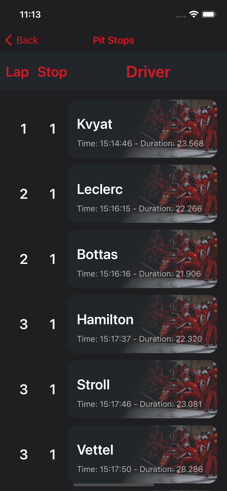

# F1App

Aplicativo voltado para os apaixonados pelo automobilismo, em especial F1. Todas as informações presentes são retirados da Api <a href="http://ergast.com/mrd/" target="_blank">Ergast Developer API</a>.

## Home

Na Home do App é exibido todos os GPs da temporada atual ordenados por data

## Tela de Detalhe

Quando é selecionado algum GP na tela de Home, é direcionado para a tela que apresenta o resultado daquele GP

## Tela de Pit Stops

Na tela de resultado do GP, é possivel selecionar a opção de visualizar os Pit Stops realizados naquele evento.

## Launch Screen

## Gerenciador de Dependências

Como gerenciador de Dependências foi utilizado o <a href="https://cocoapods.org" target="_blank">CocoaPods</a>.

## Dependências

Dependências utilizadas:

<a href="https://github.com/SnapKit/SnapKit" target="_blank">Snapkit</a>
